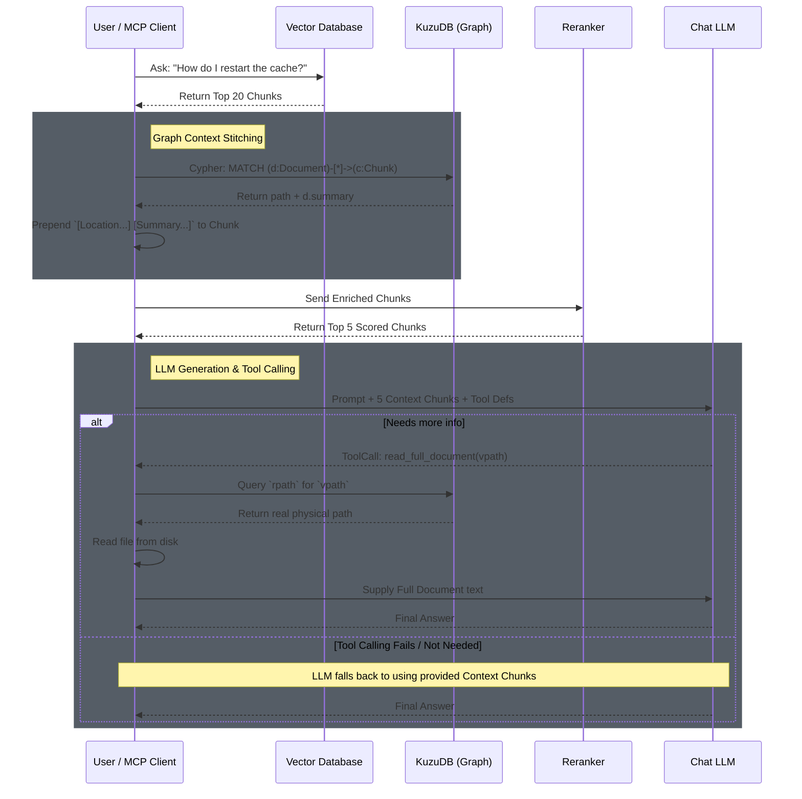

# Hierarchical GraphRAG in Gleann

This document outlines Gleann's **Hierarchical GraphRAG** architecture. It explains how Gleann leverages its embedded Graph Database (KuzuDB) not just for analyzing code ASTs, but for perfectly understanding the physical and logical structure of your documents (Folders, Files, and Markdown Headings).

---

## The Problem: The "Lost Context" in RAG

In traditional Vector RAG systems, documents are split into chunks (e.g., 512 tokens). Splitting is necessary because embedding models lose precision on massive texts, and Rerankers strictly truncate anything beyond 512 tokens.

However, stripping a chunk out of a 50-page document removes its spatial context. 
If a chunk says:
> *"Run the manual override script to clear the cache."*

The LLM reading this chunk doesn't know:
1. Is this script for the **Database**, the **Frontend**, or the **CI/CD pipeline**?
2. Is this for **Production** or **Local Development**?

The traditional, flawed solution is to "make chunks bigger" (e.g., 8000 tokens), which destroys vector search accuracy and crashes local GPU memory.

---

## The Solution: The Hierarchical Spatial Graph

Gleann solves this by mapping the entire structural hierarchy of your workspace into KuzuDB nodes and edges during `gleann build`.

### 1. The Graph Schema Structure

Instead of just storing chunks in a flat vector database, Gleann creates the following graph tree:

**Nodes:**
- `Folder`
    - *Metadata:* `name` (e.g., "production"), `vpath` (e.g., "/docs/production")
- `Document` 
    - *Metadata:* `name` (e.g., "maintenance.md"), `rpath` (e.g., "/home/tevfik/projects/repo/docs/maintenance.md"), `vpath` (relative project path e.g., "/docs/maintenance.md"), `hash` (SHA-256 for fast incremental `gleann watch`), `summary` (Extractive 3-sentence summary)
- `Heading` 
    - *Metadata:* `name` (e.g., "Database Operations"), `level` (1-6)
- `Chunk` 
    - *Metadata:* `id` (VectorDB pointer), `start_char`, `end_char`

**Edges (Relationships):**
- `CONTAINS_DOC` (`Folder` → `Document`)
- `HAS_HEADING` (`Document` → `Heading`)
- `CHILD_HEADING` (`Heading` (H1) → `Heading` (H2))
- `HAS_CHUNK` (`Heading` → `Chunk` OR `Document` → `Chunk`)

### 2. How the Search Pipeline Uses the Graph

When a user asks: *"How do I restart the cache?"*

1. **Precision Vector Match:** The BM25/Vector hybrid search perfectly targets `Chunk_42`: *"Run the manual override script to clear the cache."*
2. **Instant Graph Traversal:** Before passing this text anywhere, Gleann runs a lightning-fast Cypher query starting at `Chunk_42` and crawling *up* the tree to the root:
   ```cypher
   MATCH (f:Folder)-[:CONTAINS_DOC]->(d:Document)-[:HAS_HEADING]->(h1:Heading)-[:CHILD_HEADING]->(h2:Heading)-[:HAS_CHUNK]->(c:Chunk {id: 'Chunk_42'})
   RETURN f.name, d.summary, h1.name, h2.name
   ```
3. **Context Stitching:** The engine instantly realizes this chunk lives at:
   `/docs/production/maintenance.md > Database Operations > Emergency Overrides`
4. **Enriched Injection:** The Reranker and the LLM receive:
   > `[Context Path: /docs/production/maintenance.md > Database Operations > Emergency Overrides]`
   > `[Document Summary: Procedures for maintaining critical prod systems.]`
   > `Content: Run the manual override script to clear the cache.`

### 3. Benefits of the Hierarchical Graph

- **Eliminates LLM Hallucination:** The LLM perfectly understands that the script is for *Production Database Overrides*, completely eliminating ambiguous answers.
### 4. End-to-End Execution Flow (Mermaid Diagram)

The following sequence diagram illustrates the complete RAG query pipeline, from vector matching to graph context traversal, tool calling, and fallback mechanics.



### 5. How the LLM Fetches the Full File (Tool Calling & MCP)

The user raised an excellent point: *How exactly does the LLM know how to fetch the rest of the file using the `vpath`? And what about MCP?*

Gleann achieves this through native **LLM Tool Calling (Function Calling)**:

1. **System Prompt Injection:** When Gleann sends the context blocks to the LLM, it injects a small instruction: *"You have snippets from various files. If a snippet is insufficient, you can call the `read_full_document(vpath)` tool to read the entire file."*
2. **The LLM Decides:** The LLM reads the enriched chunk: `[Location: /docs/maintenance.md] Content: Run the restart script`. It realizes it lacks the script's arguments.
3. **Tool Execution:** The LLM outputs a structured Tool Call for `read_full_document(vpath="/docs/maintenance.md")`.
4. **Gleann Backend Resolution:** The Gleann backend intercepts this tool call, queries KuzuDB parameterizing the `vpath` to retrieve the `rpath` on disk (`/home/user/project/docs/maintenance.md`), reads the full file string, and feeds it back to the LLM within the same chat turn.
5. **Tool Calling Fails / Fallback:** If the LLM generates a malformed tool call, or if the user is using a model that doesn't support structured function calling, Gleann simply ignores the tool call and instructs the LLM: *"Tool call failed, please provide the best answer using only the provided context snippets."* The LLM then falls back seamlessly to the stitched chunks.

#### The MCP (Model Context Protocol) Angle
If Gleann is running as an **MCP Server** (e.g., connected to Cursor or Claude Desktop), the mechanics shift slightly:
- Gleann itself does not run the LLM. The AI Editor (Cursor/Claude) runs the LLM.
- Gleann simply exposes `read_full_document(vpath)` and `semantic_search(query)` as **MCP Tools**.
- When the AI Editor LLM decides it needs a file, it sends an MCP JSON-RPC execution request to Gleann. Gleann translates the `vpath` to `rpath`, reads the file, and returns the raw string via MCP. The editor's LLM handles the rest!

### 6. How this Graph Hierarchy Benefits Source Code

While Markdown documents use Headings (`H1`, `H2`) for their hierarchy, **Source Code** (like `main.go` or Python files) uses AST (Abstract Syntax Trees).

The Extractive Summarizer might skip `main.go` (leaving the `summary` property empty because code lacks English paragraphs), but the **Graph Hierarchy still radically improves code search**:

Instead of `Folder -> Document -> Heading -> Chunk`, Gleann maps code as:
**`Folder` → `Document` → `Symbol` (Class/Struct) → `Symbol` (Function/Method) → `Chunk`**

**Example for Code Retrieval:**
1. A chunk is found containing `db.Connect()`.
2. Gleann traces the KuzuDB graph upward: `Chunk` -> `Function: Connect()` -> `Struct: Database` -> `Document: pkg/db/postgres.go` -> `Folder: pkg/db`.
3. The LLM receives the enriched chunk:
   `[Location: pkg/db/postgres.go > Database Struct > Connect()] Content: db.Connect()`

This stops the LLM from confusing a backend database connector with a frontend API connector, purely because the Graph DB provided the exact hierarchical map of the codebase.
